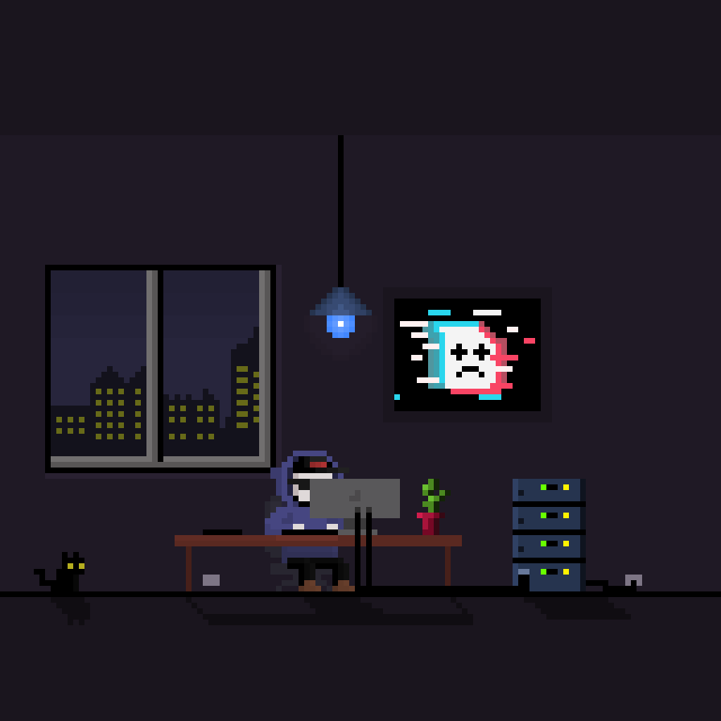

## 👨‍💻 About Me

Hi 👋 I'm Diego. I'm a programmer, coder, software developer (whatever you wanna name it). I basically build software or at least try it. I'm mainly specialized in the ``backend`` side, ``Java``, ``Go``, ``REST``, ``Docker``, ``Databases``, `AWS`, `Terraform`, `DevOps`, all that stuffs.

I also do ``Pixel art``, i'm not a pro but enjoy it a lot. So if you dig in my repos you'll find some of my pixel art projects.

I hope you can find something useful here, if you do, please let me know, i'll be glad to hear that ✌.

## 📊 My GitHub Stats

